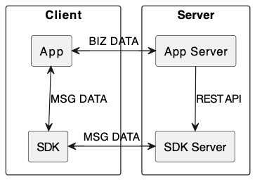
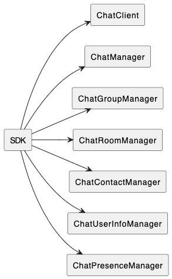
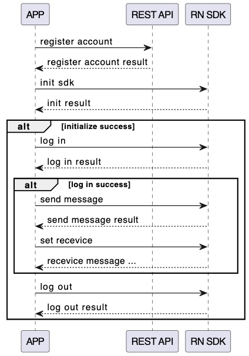

# Introduce React Native Chat SDK

SDK 实现了消息实时传递。它可以完成消息的发送、接收、离线消息的通知，好友、群组、聊天室的管理。
底层依赖原生平台SDK。
The SDK implements real-time message delivery. It can send and receive messages, notify offline messages, manage friends, groups, and chat rooms.
The bottom layer depends on the native platform SDK.

## Requirements for users

在集成 SDK，跑通 demo 之前，建议先看看下面的基本要求。
Before integrating the SDK and running the demo, it is recommended to take a look at the following basic requirements.

- `iOS` platform: [detail](./common/ios_requirements.md)
- `Android` platform: [detail](./common/android_requirements.md)
- `React Native` related knowledge.
- `iOS` or `Android` related knowledge.

## Introduction to the core of the SDK

客户端和服务器端的关系
client-server relationship
  
这个是关系示例图。
App 集成 SDK 可以实现消息数据的发送和接收。AppServer 通过 REST 接口完成相关操作，例如请求注册用户，请求登录 token。
典型使用场景：用户客户端集成这个 SDK, 服务器端访问 REST 接口，实现登录和退出，消息的发送和接收。
This is an example diagram of the relationship.
App integration SDK can realize the sending and receiving of message data. AppServer completes related operations through the REST interface, such as requesting a registered user and requesting a login token.
Typical usage scenarios: The user client integrates the SDK, and the server accesses the REST interface to log in and log out, and send and receive messages.

客户端的主要对象
Client core object

- 这个是 SDK 核心组件。
- ChatClient 是单实例对象，实现 SDK 初始化、参数配置、登录、退出等基本功能。
- ChatManager 实现消息的发送、接收功能。
- ChatGroupManager 实现群组的管理。包括创建群组、销毁群组、更新群组信息、管理成员等功能。
- ChatRoomManager 实现聊天的管理。包括创建聊天室、更新信息、成员管理等功能。
- ChatContactManager 实现通讯录的管理。包括添加好友、删除好友等功能。
- ChatUserInfoManager 实现用户信息获取、更新当前用户信息的功能。
- ChatPresenceManager 订阅用户状态管理。典型应用场景，例如：当前用户发布“我正在忙”的状态，订阅者将收到该状态。
- This is the core component of the SDK.
- ChatClient is a single-instance object that implements basic functions such as SDK initialization, parameter configuration, login, and logout.
- ChatManager implements message sending and receiving functions.
- ChatGroupManager implements group management. Including functions such as creating groups, destroying groups, updating group information, and managing members.
- ChatRoomManager implements chat management. Including functions such as creating chat rooms, updating information, and member management.
- ChatContactManager implements the management of the address book. Including adding friends, deleting friends and other functions.
- ChatUserInfoManager realizes the functions of obtaining user information and updating the current user information.
- ChatPresenceManager subscription user state management. Typical application scenarios, for example: the current user publishes the status "I am busy", and the subscribers will receive the status.

# Typical scenario usage

对于 SDK 的典型使用场景，这里做了具体的说明。
For the typical usage scenarios of the SDK, specific instructions are made here.

SDK 的初始化示例。
SDK initialization example.
[detail](./common/sdk_init.md)

注册用户示例。
Example of a registered user.
[detail](./common/register_account.md)

用户登录和退出示例。
User login and logout example.
[detail](./common/login_and_logout.md)

发送消息示例。
Send message example.
[detail](./common/send_message.md)

接收消息示例。
Receive message example.
[detail](./common/receive_message.md)

接收离线消息通知示例。
Example of receiving offline messages notification.
[detail](./common/receive_offline_notification.md)
**还没有发布要不要讲？**

# App Demo
2个模拟器进行消息发送和接收。
1个模拟器进行其他流程。

# References

[react native dev](https://reactnative.dev/)  
[react native firebase](https://rnfirebase.io/)  
[firebase console](https://console.firebase.google.com)
